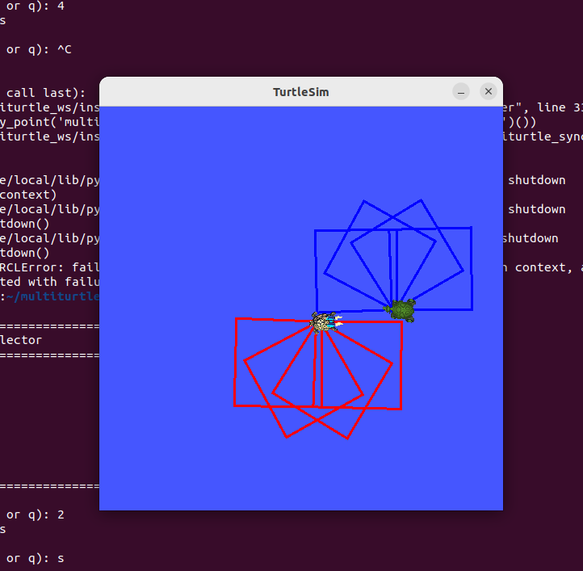
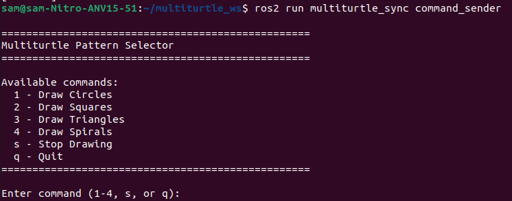

# ROS2 Multiturtle Synchronized Drawing

A beginner-friendly ROS2 Humble project demonstrating synchronized pattern drawing with multiple turtles in the `turtlesim` simulator. This project showcases usage of ROS2 concepts such as nodes, publishers, subscribers, and services, along with Python programming, coordination, and inter-process communication.

---

## Features

- Spawns multiple turtles with distinct colors (red and blue)
- Draws synchronized geometric patterns: circles, squares, triangles, and spirals
- Interactive command-line menu to select and control patterns
- Fully software-based: runs on laptop without any physical hardware
- Modular Python3 ROS2 nodes emphasizing clarity and maintainability

---

## Demo

*(Add your own screenshots or GIFs here to visually demonstrate the patterns)*

---

## Installation

### Prerequisites

- ROS2 Humble installed ([Installation Guide](https://docs.ros.org/en/humble/Installation.html))
- `turtlesim` package installed

### Clone and Build

git clone https://github.com/samshoni/ros2-multiturtle-sync.git
cd ros2-multiturtle-sync
colcon build
source install/setup.bash

### Command Menu Options

In Terminal 3, use the following keys to control turtle drawing patterns:
- `1` — Draw Circles
- `2` — Draw Squares
- `3` — Draw Triangles
- `4` — Draw Spirals
- `s` — Stop Drawing
- `q` — Quit the command menu

---

## Project Structure

- `src/multiturtle_sync/multiturtle_sync/` — Python ROS2 node scripts
- `img/` — Project screenshots and visuals (add your own images here)
- `README.md` — This project documentation

---

## Contributing

Contributions and suggestions are welcome! Feel free to submit issues or pull requests for new patterns, improvements, or bug fixes.

---

## License

This project is licensed under the MIT License.

---

Made by [samshoni](https://github.com/samshoni)

